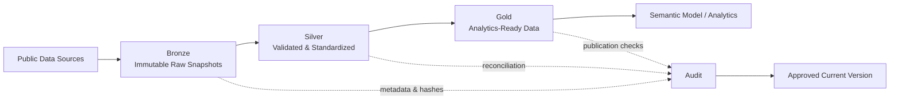

I did not start **CLIMARISK** because I wanted to build another dashboard.

I started it because I wanted to understand a domain that has always been close to me, but never part of my day-to-day work: **climate and agriculture**. Living in Goiás, one of Brazil's major agricultural states, makes the scale of agribusiness hard to ignore. The more I read about ENSO, crop estimates, climate anomalies, and commodity markets, the more I realized that the most interesting question was not *which chart should I build?*

It was a more basic one:

> **Can I trust the data that will eventually feed the chart?**

That question changed the direction of the project.

This first post in the CLIMARISK series is about the foundation: the architecture and engineering decisions that came before the analytics layer.

## What is CLIMARISK?

CLIMARISK is a portfolio project that I am developing in modules. The long-term idea is to connect climate signals, local weather conditions, agricultural production, crop estimates, and market data into one analytical product.

The project currently works with public datasets such as:

- NOAA climate and ENSO data;
- NASA POWER agroclimatology;
- IBGE PAM and LSPA agricultural datasets;
- CONAB crop progress data;
- World Bank commodity prices.

The final product will eventually include interactive analytics and predictive components, but I deliberately started one layer lower.

Before building a polished interface, I wanted a pipeline that could answer questions such as:

- Where did this number come from?
- Which raw file produced it?
- Was the source changed during transformation?
- Can I reproduce a previous run?
- Can I compare the latest load with the previous one?
- If publication fails halfway through, can I recover the last approved version?

A CSV in a folder was no longer enough.

## The first version worked — but that was the problem

The early pipeline was functional. Python scripts downloaded data, transformations ran, and final files appeared.

That is also where the first architectural problem became obvious.

Persisted data was spread across folders such as `output/` and `_runtime/`. The latest file was easy to find, but the history behind it was not as clear. A successful execution could tell me that the script had finished, but not necessarily that the dataset was **auditable, reproducible, and safe to publish**.

That distinction became one of the most useful lessons in the project:

> **A script that runs successfully is not automatically a reliable data pipeline.**

So I stopped adding features for a while and refactored the foundation.

## The architecture I ended up with

I adopted a local **Medallion Architecture** with Bronze, Silver, and Gold layers, but I did not want the project to become three folders with fancy names.

Each layer needed a clear engineering contract.



### Bronze — preserve the evidence

The Bronze layer stores the source payload as it was received.

The main rule is simple: **raw data should not be silently rewritten**.

For each extraction, the pipeline records information such as:

- source;
- file path;
- extraction timestamp;
- payload size;
- SHA-256 checksum;
- run identifier.

The raw snapshot is stored under a versioned path. If I need to investigate a transformation later, I still have the original evidence that produced it.

### Silver — make the data usable without losing meaning

Silver is where schemas, types, keys, and source-specific rules are standardized.

One important principle here is that Silver is processed from the captured Bronze snapshot rather than calling the source again during transformation. This sounds small, but it changes reproducibility completely.

If a source API changes tomorrow, I can still replay yesterday's pipeline using yesterday's captured input.

### Gold — publish only what passed validation

Gold contains the datasets prepared for analytical consumption.

The important word is **approved**.

The pipeline does not simply overwrite the file consumed by the analytical layer. Each successful run first creates a versioned dataset and only promotes it to `current/` after validation succeeds.

That gives the project two concepts at the same time:

- **history**, stored under `versions/<run_id>/`;
- **stable consumption**, exposed through `current/`.

The future analytical layer can point to a stable path without destroying the history behind it.

## One `data/` directory, with a reason behind it

One of the changes I made during the refactor was centralizing every persisted dataset under a single `data/` directory.

The structure now follows both the Medallion layer and the business subject:

```text
 data/
 ├── bronze/
 │   ├── climate/
 │   ├── agriculture/
 │   └── market/
 │
 ├── silver/
 │   ├── climate/
 │   ├── agriculture/
 │   └── market/
 │
 ├── gold/
 │   ├── climate/
 │   ├── agriculture/
 │   └── market/
 │
 ├── audit/
 │   ├── bronze/
 │   ├── silver/
 │   ├── gold/
 │   └── pipeline/
 │
 └── runs/
```

This change was less glamorous than building a dashboard, but it removed a lot of ambiguity.

`_runtime/` now contains only technical artifacts such as logs and execution locks. Business data no longer has hidden persistence paths outside `data/`.

## Audit became part of the pipeline, not an afterthought

I wanted auditing to answer more than *did the job finish?*

The pipeline now checks different things at different stages, including:

- file hashes;
- row counts;
- key uniqueness;
- missing or malformed records;
- source-to-transformation reconciliation;
- differences between the new Gold version and the previously published one;
- publication status.

The audit structure mirrors the data structure, so a dataset can be traced through Bronze, Silver, and Gold instead of relying on one generic log file.

The consolidated execution status also distinguishes between the **last run** and the **last successful publication**. That matters because the newest execution is not necessarily the version that consumers should trust.

## Versioning without making the consumer chase folders

A detail I wanted to solve early was the tension between reproducibility and usability.

If every run creates a new physical file path, an analytical tool should not have to be reconfigured after every load.

So the project uses a simple publication pattern:

```text
subject/
├── current/
│   └── approved_dataset.csv
└── versions/
    ├── <run_id_1>/
    │   └── approved_dataset.csv
    ├── <run_id_2>/
    │   └── approved_dataset.csv
    └── ...
```

`versions/` preserves lineage.

`current/` preserves a stable contract for consumption.

Only an audited run is allowed to update `current/`.

## Failure handling was part of the design

Another thing I wanted to avoid was a pipeline that leaves half-published data after an error.

The current orchestration includes:

- an execution lock to prevent concurrent runs;
- temporary transactional run directories;
- validation before publication;
- backup of the current approved files;
- rollback if promotion fails;
- offline replay from an existing Bronze snapshot;
- a `--no-publish` mode for validating the complete pipeline without changing the consumer-facing files.

The orchestration is handled by Python, and Windows `.bat` files provide simple entry points for the Windows Task Scheduler.

The architecture is local today by design. I wanted to prove the **data contract, controls, and lifecycle first**, rather than hiding architectural gaps behind a cloud service.

## Testing the architecture

I added automated tests around both transformation logic and the new folder/publication conventions.

At the end of this refactor:

- **15 automated tests were passing**;
- a synthetic Silver → Gold → Audit → `current/` publication was successfully validated;
- legacy `output/` persistence was removed from the analytical publication path;
- the ENSO dataset was also moved under the same CLIMARISK data convention so future climate/agriculture integration can use a consistent structure.

This does not mean the entire CLIMARISK product is finished. It means the engineering foundation has reached a point where the next layers can be built without continuously changing the ground underneath them.

## A problem I am deliberately not hiding

During the next round of source analysis, I found several semantic issues that belong to extraction and transformation rather than dashboard design.

Examples include special value symbols in IBGE/SIDRA, historical currency units, incomplete climate months, and crop mappings across datasets.

It would have been easy to clean those values just enough to make the visuals look correct.

I am doing the opposite.

Those rules are now part of the next engineering milestone because a polished dashboard over semantically weak data would defeat the purpose of the project.

That is another lesson I am taking from CLIMARISK: **data quality problems become much more expensive when they are discovered at the visualization layer.**

## What comes next

This post is **Part 1** of the CLIMARISK series.

The roadmap from here is intentionally incremental:

1. finalize source-specific extraction and transformation rules;
2. build the analytical and dimensional model;
3. publish the first climate dashboard;
4. expand the agricultural module;
5. integrate climate, agriculture, and market context;
6. explore ENSO-to-climate lag analysis and historical analogs;
7. evaluate predictive models for agricultural anomalies and crop nowcasting.

The final product will be much more visual than what I am showing today. But this first chapter is about the part users rarely see: **how the data earns the right to appear on the screen.**

---

### Tech used in this stage

`Python` · `Pandas` · `CSV/JSON` · `SHA-256` · `Medallion Architecture` · `Automated Testing` · `Windows Task Scheduler` · `Git/GitHub`

### Public data ecosystem being incorporated

[NOAA Climate Prediction Center](https://www.cpc.ncep.noaa.gov/) · [NASA POWER](https://power.larc.nasa.gov/) · [IBGE SIDRA](https://sidra.ibge.gov.br/) · [CONAB](https://www.conab.gov.br/) · [World Bank Commodity Markets](https://www.worldbank.org/en/research/commodity-markets)

*CLIMARISK is a portfolio project. Analytical indicators developed in the project are documented as project methodologies and are not presented as official indicators from the source institutions.*
