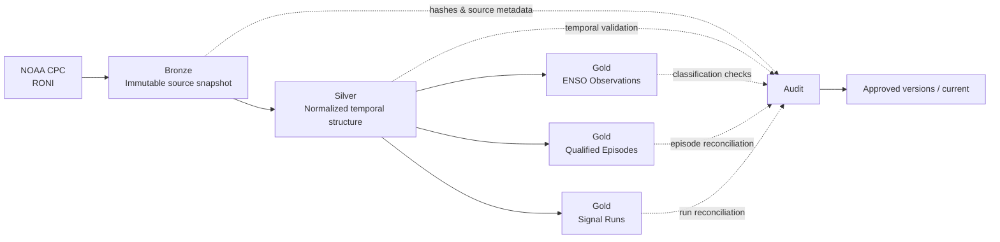

The first CLIMARISK milestone was about one question: **can I trust the data before it reaches a dashboard?**

The second milestone introduced a different kind of problem.

This time, the challenge was not only whether the pipeline could ingest and transform climate data correctly. It was whether the model could represent **time** correctly.

A single warm or cold reading is easy to classify. A climate episode is not.

That distinction became the center of the ENSO module.

## The problem: a threshold is not an episode

CLIMARISK uses the **Relative Oceanic Niño Index (RONI)** published by the NOAA Climate Prediction Center as the initial analytical signal for monitoring ENSO.

At first glance, the rule looks simple:

```text
RONI >= +0.5 °C  → Warm signal
RONI <= -0.5 °C  → Cold signal
Between them     → Neutral
```

But treating every threshold crossing as El Niño or La Niña would create a misleading analytical product.

The signal needs persistence.

For the initial CLIMARISK methodology, a sequence must remain above or below the corresponding threshold for **at least five consecutive overlapping seasons** before it is treated as a historically qualified episode.

That gave me three concepts that needed to remain separate throughout the pipeline:

```text
Climate signal
     ↓
Sequence in formation
     ↓
Qualified episode
```

It sounds like a small modeling choice. In practice, it affected the transformation logic, the Gold layer, the audit rules, the future semantic model, and even the way the dashboard will eventually tell the story.

## Extending the pipeline instead of rebuilding it

By this stage, CLIMARISK already had a working Medallion foundation with versioning, auditing, replay, rollback, execution locks, and publication controls.

I did not want the new ENSO module to become an excuse to rewrite a pipeline that was already working.

So I treated ENSO as an **incremental extension**.



The existing agricultural components did not need to be rewritten. The only central mapping file changed in an additive way so the new ENSO datasets could participate in the same project conventions.

That decision mattered because one of the goals of this project is to demonstrate not only that I can build something new, but also that I can **extend an existing system without breaking what already works**.

## Bronze: preserve the NOAA evidence

The Bronze layer keeps the original NOAA payload as an immutable snapshot.

Each execution retains the source artifact together with information such as its hash, source metadata, run identifier, and ingestion timestamp.

The module also supports safe reuse of a previously approved ENSO Bronze snapshot. If the same source has already been captured and validated, the pipeline can reuse that evidence instead of downloading it again unnecessarily.

This keeps replay and debugging grounded in the exact input that produced a transformation.

## Silver: make the seasons explicit

The NOAA source is transformed into a normalized temporal structure in Silver.

Fields such as these are prepared before any analytical classification reaches Gold:

```text
season_code
year
observation_date
season_start
season_end
center_month_number
roni_anomaly_celsius
```

This layer also validates sequence continuity, duplicate keys, period consistency, coverage, and reconciliation against Bronze.

The idea is simple: if the time structure is wrong, everything built on top of it will be wrong in a much less obvious way.

## Gold: one table was not enough

One of the most useful decisions in this milestone was to stop thinking of the ENSO Gold layer as a single output.

I created three analytical products instead:

```text
fact_enso_observation.csv
dim_enso_episode.csv
fact_enso_signal_run.csv
```

Each one answers a different question.

### 1. Observation-level history

`fact_enso_observation` keeps the season-by-season history.

It contains the RONI value, signal, threshold status, sequence length, phase classification, episode identifier, revision information, and two different qualification concepts that became especially important later.

This is the table the future ENSO monitor will use to answer questions such as:

- What is the latest signal?
- How many consecutive seasons have crossed the threshold?
- Is the sequence still forming?
- How did the current trajectory develop over time?

### 2. Qualified episodes

`dim_enso_episode` has one row per qualified episode.

Instead of recalculating episode-level metrics every time, it stores information such as start, end, duration, peak RONI, absolute peak, peak date, and mean RONI.

That makes questions like *which episodes were the longest?* or *which had the highest absolute intensity?* much cleaner for the semantic model.

### 3. Signal runs — including the ones that failed

`fact_enso_signal_run` was created for a different reason.

A dashboard that only stores qualified episodes loses an important part of the story: **signals that started but never became episodes**.

This table contains every consecutive Warm or Cold run, including sequences that ended before reaching five seasons.

That means CLIMARISK can eventually show a progression such as:

```text
Signal detected
      ↓
2 seasons
      ↓
3 seasons
      ↓
4 seasons
      ↓
5+ seasons
      ↓
Qualified episode
```

The future dashboard section is already clear in my mind: **Signal → Episode**.

## The point-in-time problem

This was the most interesting modeling problem in the milestone.

Suppose a warm sequence eventually reaches five consecutive seasons.

Looking back after the fact, all five observations belong to the same qualified episode.

But during the first season, nobody knew the sequence would reach five.

That created two different questions:

> **Knowing what I knew on that date, had the sequence already qualified?**

and

> **Knowing today how the whole sequence ended, did that observation belong to a qualified episode?**

Those are not the same thing.

So the model separates:

```text
qualification_as_of_date
```

from:

```text
roni_episode_qualified
```

The first is point-in-time.

The second is retrospective.

This prevents future information from leaking backward into a historical view.

It is a small example of a concept that becomes critical later in machine learning and forecasting: **point-in-time correctness**.

For me, this was one of the moments where the project stopped feeling like simple climate-data processing and started feeling much more like Analytics Engineering.

## Recent data is not always final data

The module also introduces `revision_status`.

Recent RONI observations may still be revised after their first publication, so the analytical layer should not pretend that every value has the same degree of maturity.

Instead of hiding that uncertainty, I want the future product to expose it.

That will eventually allow the interface to distinguish between a recent observation and a more consolidated historical record.

## Auditing three Gold products without losing traceability

The ENSO module has its own audit flow.

A practical problem appeared here: there are now three Gold datasets under the same climate subject.

If they all wrote to one generic audit path, one dataset could overwrite another dataset's audit result.

So the Gold audit was separated by analytical dataset:

```text
enso_observation
enso_episode
enso_signal_run
```

The audit checks include row counts, hashes, duplicate keys, temporal continuity, classification rules, Bronze-to-Silver reconciliation, Gold consistency, comparison with the previous publication, and overall execution quality.

This follows the same principle from Part 1: audit is part of the data product, not a log file added at the end.

## A Windows launcher bug that turned into a useful lesson

Not every important problem in this milestone was analytical.

The first Windows launcher I created for the ENSO pipeline assumed that this interpreter always existed:

```text
.venv\Scripts\python.exe
```

On my environment, that assumption was wrong.

The window opened and closed so quickly that the first symptom was simply: **nothing happened**.

The existing CLIMARISK launchers already used a safer fallback strategy:

```text
.venv
  ↓
py -3
  ↓
python
```

So I corrected the ENSO launcher to follow the same convention instead of creating a special case.

Then I added validation around the failure itself:

- check the project root;
- check required modules and configuration;
- locate a compatible Python interpreter;
- require Python 3.10+;
- forward command-line arguments;
- create a launcher-specific log;
- point to the pipeline log;
- display `last_run.json` when execution fails.

The bug was small. The lesson was bigger:

> **A pipeline should not only work when everything is correct. It should fail in a way that can be observed and diagnosed.**

That is now part of how I think about reliability in this project.

## Validation: prove the new logic did not break the old one

The baseline project had **45 automated tests**.

After the first ENSO integration, the suite reached **56**.

After adding launcher-specific tests, it reached:

```text
61 tests executed
61 tests passed
0 regressions identified
```

I also validated the new transformation against the RONI dataset that had already been produced and checked earlier in the project.

The reference contained **919 historical observations**.

The rebuilt pipeline generated:

```text
919 observations
44 qualified episodes
58 Warm/Cold signal runs
14 runs that ended without qualification
```

For the historical fields being compared:

```text
Historical divergences: 0
```

I then validated the complete publication flow:

```text
Bronze
  ↓
Silver
  ↓
Gold
  ↓
Audit
  ↓
versions/
  ↓
current/
```

including a second execution that reused an already valid Bronze snapshot.

The important result was not that the numbers looked right on a chart. It was that the new implementation reproduced the validated historical logic **without introducing regressions into the rest of the project**.

## What this module does not claim

There is another distinction I want to keep explicit before the project reaches its agricultural layers.

ENSO is not being modeled as an instantaneous cause of local weather.

I am not building a rule that says:

```text
RONI this month
=
local climate impact this month
```

The relationship can involve teleconnections, seasonality, geography, accumulated conditions, and temporal lags.

So the engineering layer stores the ENSO history without hardcoding a causal delay.

A later Data Science milestone will test relationships such as:

```text
RONI lag 0
RONI lag 1
RONI lag 2
RONI lag 3
RONI lag 6
```

against precipitation anomalies, temperature anomalies, soil moisture, dry days, heat days, and heavy-rain days.

The question will be:

> **Which historical lag contains useful explanatory or predictive information for a specific region and climate variable?**

Not:

> **After X months, ENSO necessarily causes Y.**

That distinction is important to the scientific direction of CLIMARISK.

## What comes next

Part 1 established the engineering foundation.

Part 2 turned ENSO into a structured, auditable analytical module that can distinguish a signal from an episode and a retrospective classification from what was actually knowable at the time.

The next milestone is where this starts becoming easier to consume: **analytical and semantic modeling**.

That means designing dimensions, relationships, measures, and a model that can support the first climate dashboard without pushing transformation logic back into the visualization layer.

The interface will come soon.

But first, I want the model behind it to deserve the same level of attention as the pipeline feeding it.

---

### Tech used in this stage

`Python` · `Pandas` · `CSV/JSON` · `SHA-256` · `Medallion Architecture` · `Temporal Modeling` · `Point-in-Time Analysis` · `Automated Testing` · `Windows Batch` · `Git/GitHub`

### Source

[NOAA Climate Prediction Center](https://www.cpc.ncep.noaa.gov/)

*CLIMARISK is a portfolio project. Analytical classifications and derived indicators used by the project are documented as project methodologies. The project separates observed data, analytical rules, historical association, and future predictive work rather than presenting them as equivalent concepts.*

---

### Previous in the series

[**Part 1 — Architecture & Data Engineering →**](/posts/climarisk-part-1-architecture-data-engineering/)

### Next in the series

**Part 3 — Data Modeling** — coming next.
